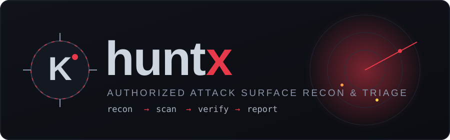
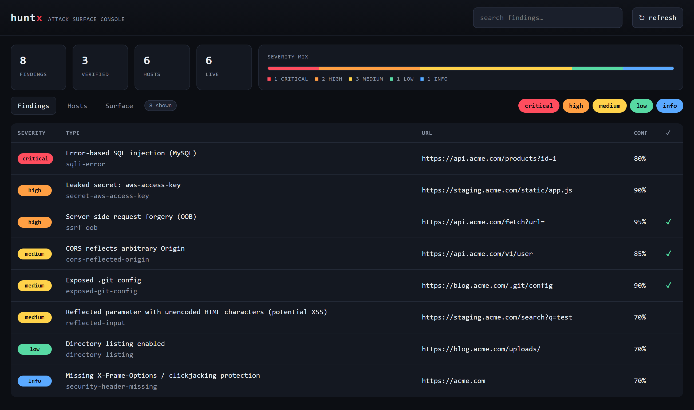
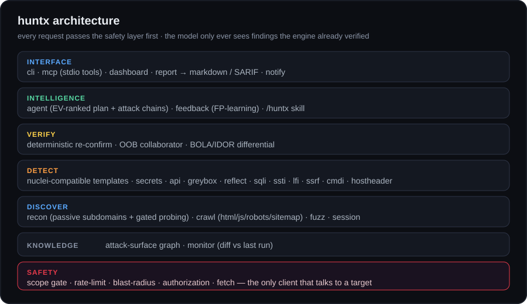

<p align="center">
  
</p>

<p align="center">
  <a href="https://talkdedsec.github.io/tlk-huntx/"></a>
  <a href="https://github.com/talkdedsec/tlk-huntx/actions/workflows/ci.yml"></a>
  <a href="https://github.com/talkdedsec/tlk-huntx/releases"></a>
  
  
</p>

<p align="center">
  <b>A single-binary bug bounty engine.</b><br>
  Scope-gated recon · template + active detection · deterministic verification · LLM-assisted triage — in one static Go binary, zero runtime dependencies.
</p>

> [!WARNING]
> **huntx proves vulnerabilities, it does not exploit them.** Only test targets you own or are
> explicitly authorized to test. Active commands refuse to run without a scope file and
> `--authorized`; rate-limiting, a total-request cap, and a block on state-changing methods are on
> by default. Read [SECURITY.md](SECURITY.md).

---

## Live demo

<p align="center">
  
</p>

**[talkdedsec.github.io/tlk-huntx](https://talkdedsec.github.io/tlk-huntx/)** — the same dashboard,
live in your browser on sample data. Click a finding for the detail drawer (evidence, repro, CWE),
filter by severity, and open the **Surface** tab for the attack-surface graph.

## What it is

The recon/scan space is full of great Go tools — nuclei, httpx, katana, bbot, reconftw. What nobody
ships open-source is the part the closed tools (XBOW, Elastic) charge for: a **machine-readable scope
gate**, **two-tier verification** (engine finds → a deterministic check re-confirms → only then does a
language model see it), semantic dedup, and a human-ready report — all in **one dependency-free binary**.

The core rule, drawn from every AI-security post-mortem: **an LLM finds, an LLM never confirms.**
Verification is deterministic and out-of-band; the model only ever clusters, explains, and writes up
findings the engine already proved.

```text
                   ┌───────────────────────────────────────────┐
  in-scope target →│  safety gate                              │  the fetch client is the
       scope.json →│  scope · rate-limit · blast · authorized  │  only thing that ever
       identities →│                                           │  touches a target
                   └───────────────────────────────────────────┘
                                         │
                                         ▼

        discover  →  detect         →  verify       →  intelligence    →  interface
        ────────  →  ──────         →  ──────       →  ────────────    →  ─────────
        recon        templates         re-confirm      EV-ranked plan     dashboard
        crawl        secrets           OOB collab.     attack chains      report md/SARIF
        fuzz         active checks     BOLA / IDOR     FP feedback        mcp · /huntx
        api          greybox           out-of-band     clusters           notify · monitor

            an engine finds  ·  a deterministic check proves  ·  only then a model triages
```

## Install

```bash
# from source (needs Go 1.26+)
go install github.com/talkdedsec/tlk-huntx/cmd/huntx@latest

# or clone and build
git clone https://github.com/talkdedsec/tlk-huntx
cd tlk-huntx && go build -o huntx ./cmd/huntx
```

Pre-built binaries for linux/windows/darwin (amd64 + arm64) are on the
[releases](https://github.com/talkdedsec/tlk-huntx/releases) page.

## 60-second quickstart

```bash
# 1. describe what you're allowed to test
cat > scope.json <<'EOF'
{ "program":"acme", "in_scope":["*.acme.com"], "allowed_methods":["GET","HEAD","OPTIONS"] }
EOF

# 2. is a target in scope? (sends nothing)
huntx --scope scope.json scope check api.acme.com evil.com

# 3. one shot: recon + crawl + scan + active checks + a ranked plan
huntx --scope scope.json --authorized full acme.com

# 4. read the results in the browser
huntx dashboard              # http://localhost:8899

# 5. or produce a report
huntx --scope scope.json report huntx.findings.jsonl -o report.md
huntx report huntx.findings.jsonl -o huntx.sarif   # SARIF for CI / code-scanning
```

## Commands

| Command | What it does |
|---|---|
| `scope check` | Is a target in scope (sends nothing) |
| `recon` | Passive subdomains (crt.sh, Wayback, OTX, HackerTarget) + gated probing + graph |
| `full` | One shot: recon + crawl + scan + active param checks + ranked plan |
| `scan` | nuclei-compatible templates + secret scan (`--verify` to re-confirm) |
| `crawl` | Mine endpoints/params from HTML, JS, robots.txt, sitemap.xml |
| `fuzz` | Content discovery over a common-paths wordlist (soft-404 aware) |
| `api` | GraphQL introspection + OpenAPI/Swagger discovery |
| `reflect` · `sqli` · `ssti` · `lfi` | Per-parameter active checks (reflected XSS, error SQLi, template injection, path traversal) |
| `redirect` | Open-redirect detection |
| `ssrf` · `cmdi` | Out-of-band SSRF / command injection via a built-in collaborator |
| `hostheader` | Host-header injection |
| `bola` / `idor` | Object-level authz test across named identities |
| `greybox` | Correlate dangerous source sinks with live endpoints |
| `plan` | Rank findings by expected value and compose attack chains |
| `monitor` | Diff vs the last run; `--interval` to repeat, `--notify` webhook |
| `feedback` | Record triage decisions, self-calibrate confidence |
| `report` | Markdown or SARIF output (`--min-severity` to filter) |
| `dashboard` | Interactive local console (see the live demo) |
| `coordinate` / `worker` | Distributed scanning |
| `collaborator` | Standalone OOB interaction server |
| `mcp` | Model Context Protocol server (stdio) — drive huntx as typed tools |

Every active command enforces the scope gate; global flags may appear before or after the command.

## Drive it from an agent

`huntx mcp` exposes the engine over the Model Context Protocol (stdio, JSON-RPC 2.0). An LLM agent
calls `scope_check` / `recon` / `scan` / `plan` / `api` / `crawl` as typed tools instead of parsing
CLI text. The `/huntx` skill in [`skill/huntx`](skill/huntx/SKILL.md) layers triage, dedup, and report
writing on top — the engine finds and proves, the model clusters and writes.

## Safety by design

- **Scope gate** — a machine-readable in/out-of-scope decision (wildcards + CIDR, out-of-scope wins) on
  every outbound request. Nothing leaves the tool without passing it.
- **Rate limit** — per-host token bucket, global concurrency cap, automatic 429/WAF back-off.
- **Blast radius** — a total-request budget and a block on state-changing methods unless you opt in.
- **Authorization** — active pipelines refuse to run without a scope file *and* `--authorized`.
- **Detection, not exploitation** — probes prove a condition (a quote, a reflection, an OOB callback);
  they never carry destructive or DoS payloads.

## Architecture

<p align="center"></p>

See [docs/ARCHITECTURE.md](docs/ARCHITECTURE.md) for the layer/package map. In one line: a `fetch`
client that is the *only* thing allowed to touch a target, wrapped by scope + rate-limit + blast-radius,
feeding a discover → detect → verify → intelligence → interface stack.

## Contributing

Issues and templates are welcome — keep additions detection-only and inside the safety gates. See
[CONTRIBUTING.md](CONTRIBUTING.md). Türkçe: [README.tr.md](README.tr.md).

## License

MIT — see [LICENSE](LICENSE).
